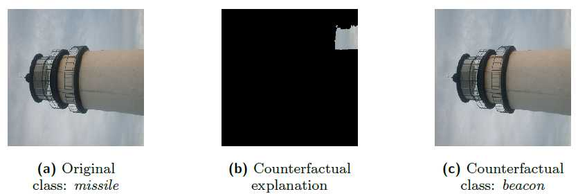

##### Work on counterfactual explanations by Applied Data Mining (UAntwerp)

| Data       | Algorithm                                                                                                              | Reference                    |
|------------|------------------------------------------------------------------------------------------------------------------------|------------------------------|
| TEXT       | [SEDC](https://github.com/ADMAntwerp/edc)                                                                              | Martens and Provost (2014)   |
|            | [LIME-C](https://github.com/ADMAntwerp/LimeCounterfactual), [SHAP-C](https://github.com/ADMAntwerp/ShapCounterfactual) | Ramon et al (2020)           |
| BEHAVIORAL | [SEDC](https://github.com/ADMAntwerp/edc)                                                                              | Martens and Provost (2014)   |
|            | [LIME-C](https://github.com/ADMAntwerp/LimeCounterfactual), [SHAP-C](https://github.com/ADMAntwerp/ShapCounterfactual) | Ramon et al (2020)           |
| IMAGE      | SEDC(-T)                                                                                                               | Vermeire and Martens (2020)  |
| STRUCTURED | NICE                                                                                                                   | Brughmans and Martens (2021) |

**Counterfactual explantions provide evidence leading to that decision by the prediction model. More formally, an evidence counterfactual provides a minimum set of evidence present in the data instance to be explained such that removing that evidence would change the decision, and were introduced in the predictive modeling domain by Martens and Provost in 2014. Some examples:**

For behavioural data, explain why I am shown this republican ad on Facebook: If you would not have liked the Facebook pages *“Fox News, Nascar and Trump”* then the class would change from republican to centre. Similar explanations could be provided to explain certain personality or ad interest predictions.

For image data: the evidence counterfactual would indicate which parts of the picture, when they would be removed, would change the class. Consider the image below of a lighthouse that is misclassified as a missile. You might think that the shape is likely the reason. The counterfactual shows however that the image has clouds that are similar to an exhaust plume that is often found behind missiles. If that cloud is removed, then the class changes to the correct class, indicating that the cloud is the reason for the misclassification.

For textual data: when predicting which candidates to invite for an interview to a job opening, based on the words of the resume of the candidate, one would want to explain why someone is classified as being unsuitable for an engineering position. An example EdC could be: If the words *“philosophy, mcdonalds and COBOL“* would not appear on your resume then the class would change to suitable for an engineering position. This provides insight that the model has learnt not to invite philosophy graduates that are (former) mcdonalds employees and are working with COBOL.

**Why counterfactual explanations?**
They explain individual decisions made by models, which most end users are interested in. Advantages over other approaches are that there is no limitation on the complexity of the model, it avoids disclosing the model to the end user, it provides a concrete justification for a decision, allows to automate the challenging task of generating explanations, and provides explanations that comply with the GDPR legal requirements on this matter. The European Parliamentary Research Service recently came out with [a study](https://www.europarl.europa.eu/thinktank/en/document.html?reference=EPRS_STU(2019)624261) on the opportunities and challenges of *“understanding algorithmic decision-making”*, where the need for explanations is motivated in detail. In their conclusion, they state that *“affected people will probably be more interested in the reasons for the decisions that affect them (local and causal explanations) and how they can influence them (counterfactual explanations)”* 

### References

[**David Martens, Foster Provost (2014)**  
*Explaining data-driven document classifications*  
MIS Quarterly 38 (1), 73-100](https://archivefda.dlib.nyu.edu/jspui/bitstream/2451/31831/2/Provost%202_13.02.pdf)

[**Ramon Yanou, Martens David, Provost Foster, Evgeniou Theodoros (2020)**  
*A comparison of instance-level counterfactual explanation algorithms for behavioral and textual data : SEDC, LIME-C and SHAP-C*  
Advances in Data Analysis and Classification 2020, 14:4, p. 801-819](https://rdcu.be/b6HCl)

[**Vermeire Tom, Martens David (2020)**  
*Explainable image classification with evidence counterfactual*  
arXiv - 2020, 23 p. https://arxiv.org/abs/2004.07511](https://arxiv.org/abs/2004.07511)

**Brughmans Dieter, Martens David (2021)**  
*NICE*  
arXiv
